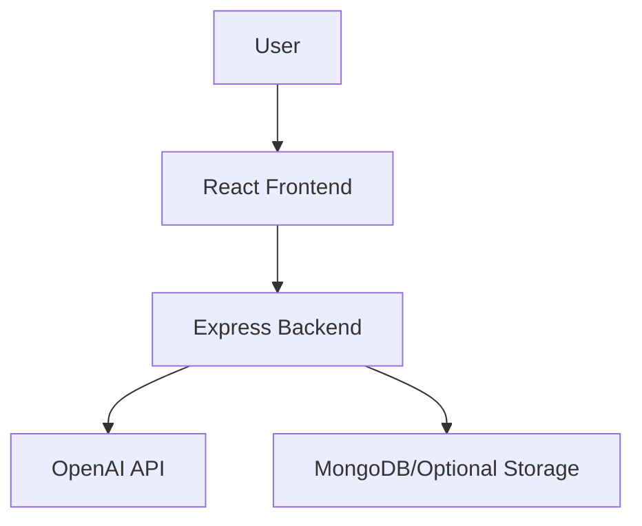

# ChatGPT Clone

An **AI-powered conversational assistant** built using **React, Node.js, and OpenAI API**. This project demonstrates **end-to-end full-stack engineering**, **applied AI/ML integration**, and **cloud-ready deployment**—showcasing the skills required to build products at scale like those at **Google**.

---

## Project Structure

```
ChatgptClone/
│── clone/                 # Backend (Node.js + Express)
│   ├── node_modules/
│   ├── .env               # Environment variables (API keys, secrets)
│   ├── server.js          # Backend entry point
│   ├── package.json
│   └── package-lock.json
│
│── public/                # Static assets
│   ├── index.html         # Main HTML file
│   └── server.js
│
│── src/                   # Frontend (React)
│   ├── assets/            # Images, icons
│   ├── App.css
│   ├── App.js             # React root component
│   ├── index.js           # Frontend entry point
│   └── openai.js          # OpenAI API integration
│
│── .gitignore
│── package.json           # Frontend dependencies
│── package-lock.json
│── README.md              # Project documentation
```

---

## Features

* **AI Chatbot** – Real-time conversations powered by OpenAI API
* **Modern UI** – Responsive design built with React
* **Backend API** – Node.js server with Express.js
* **Secure Config** – `.env` support for API keys & secrets
* **Scalable Deployment** – Docker-ready, deployable on AWS/GCP
* **Extendable Architecture** – Easy to add analytics, auth, or new ML models

---

## Tech Stack

**Frontend:** React, JavaScript, CSS
**Backend:** Node.js, Express.js
**AI Engine:** OpenAI API (GPT models)
**Deployment Ready:** Docker, AWS/GCP
**Version Control:** Git + GitHub

---

## Getting Started

### Clone Repository

```bash
git clone https://github.com/rmanojgowda/chatgpt-clone.git
cd ChatgptClone
```

### Install Dependencies

For frontend:

```bash
npm install
```

For backend (inside `clone/`):

```bash
cd clone
npm install
```

### Configure Environment

Create a `.env` file inside `clone/`:

```env
OPENAI_API_KEY=your_openai_api_key
PORT=5000
```

### Start Backend Server

```bash
cd clone
node server.js
```

### Start Frontend

```bash
npm start
```

The app will be available at:
Frontend: `http://localhost:3000`
Backend: `http://localhost:5000`

---

## System Design



* **Frontend (React)** handles UI/UX
* **Backend (Node.js + Express)** routes requests
* **OpenAI API** powers AI conversations
* **Database (optional)** stores chat history

---

## Roadmap

* [x] Basic chatbot with OpenAI API
* [x] React frontend + Node.js backend integration
* [ ] Add **authentication (JWT + OAuth)**
* [ ] Deploy on **AWS/GCP with Docker & Kubernetes**
* [ ] Add **analytics dashboard**
* [ ] Extend with **custom ML model (TensorFlow/PyTorch)**

---

## Security

* Environment variables stored in `.env`
* No API keys committed to source control
* Ready for HTTPS & JWT-based authentication

---

## Why This Project Matters

* **Full-stack engineering**: React + Node.js + API integrations
* **AI/ML applied**: Hands-on with OpenAI GPT models
* **Cloud & DevOps readiness**: Docker + scalable architecture
* **Recruiter impact**: Demonstrates end-to-end product development at scale

---

## License

MIT License © 2025 [Manoj Gowda BG](https://github.com/rmanojgowda)

---
